### **CSED342 - Artificial Intelligence**

# **Assignment 4. K-Means Clustering**

<div style="text-align: right"> 20180373 김현지 </div>

------------------------------

## **Problem 1e: Clustering 2D points**
### **Result - `python kmeans.py`**

|||
|:-:|:-:|
|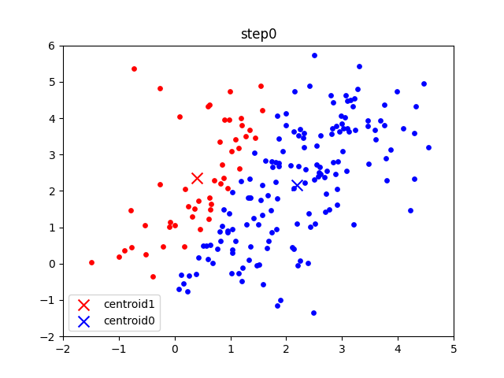|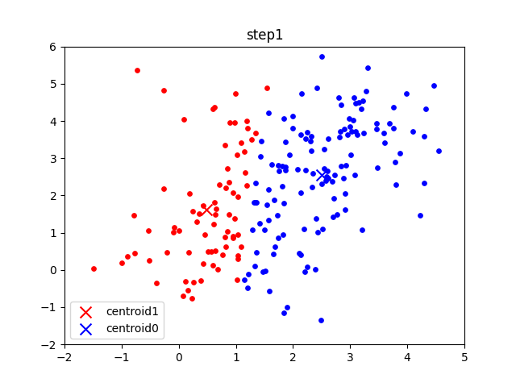|
||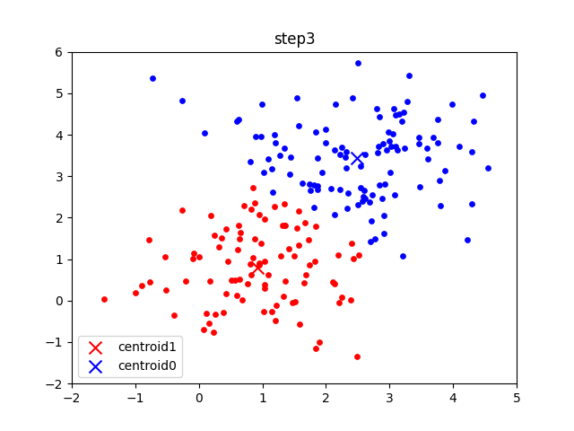|
|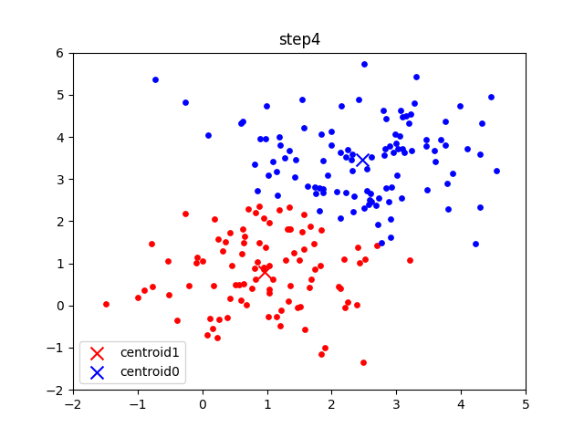||
|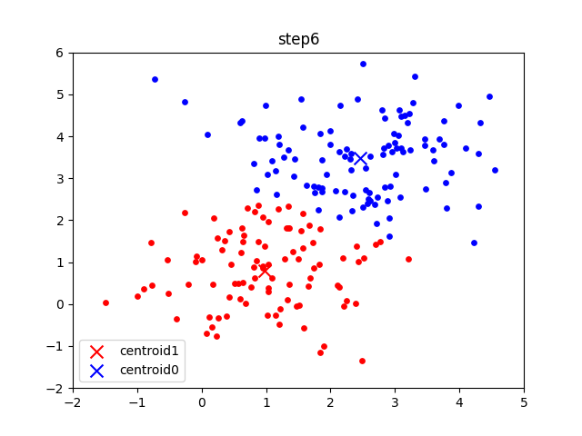||

------------------------------

## **Problem 1f: Trying the Algorithm on MNIST**
### **Q. Why the centroid of each cluster looks like an actual digit?**

```
mnist dataset의 여러 data point(number image)들이 그저 Gaussian noise처럼 보이는 init centroid image중 그나마 가장 유사한 centroid image에 clustering된다. 그 후, 각 centroid에 대해 모인 data point image에 대해 centroid를 다시 찾고, 다시 clustering하고, centroid를 찾는 과정을 반복한다. 그러다 보면, 점점 그 centroid는 결국 mnist dataset에 있는 숫자들의 이미지의 평균값이기 때문에, 반복하다보면 특정 숫자와 유사한 형태의 centroid를 그리게 되는것이다.
```

------------------------------

## **Problem 2d: Clustering 2D points**

### **Result - `python soft_kmeans.py`**

|||
|:-:|:-:|
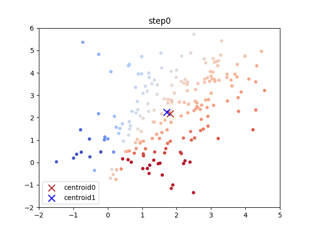|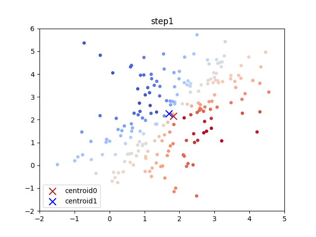
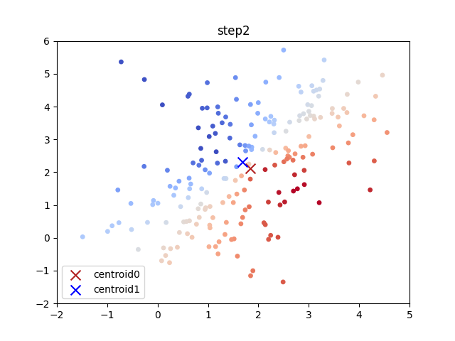|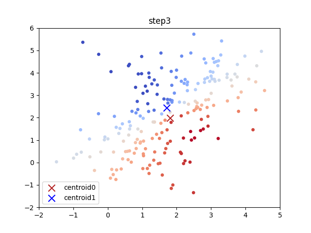
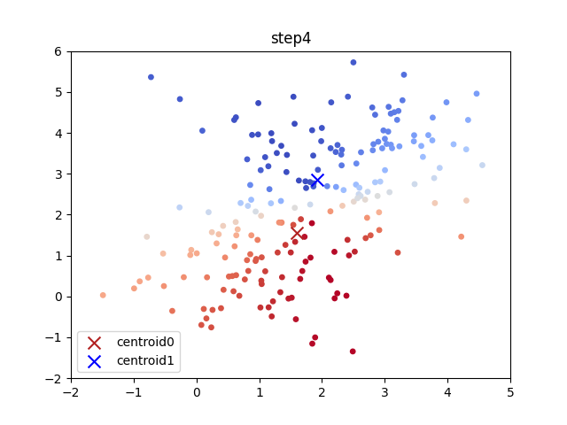|
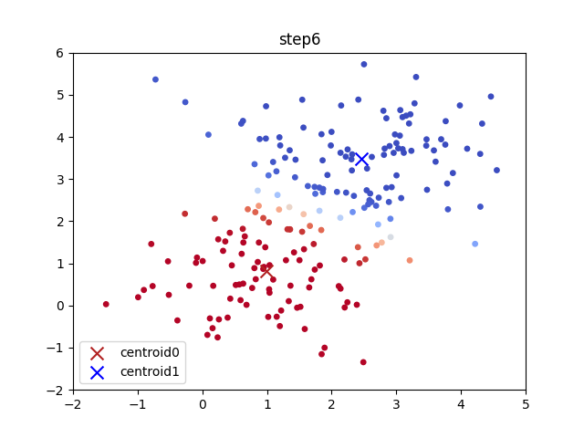|

### **Result - Changed β to 50**

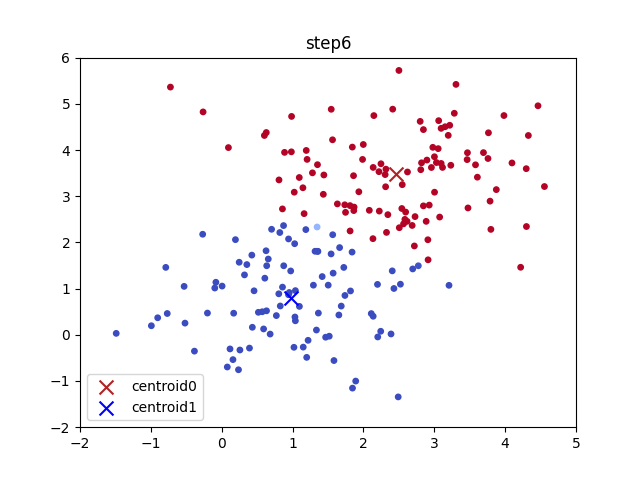

```
hard k-mean clustering은 각 data point가 속한 cluster의 경계를 명확히 나누는 반면, soft k-mean clustering은 data point마다 각 cluster에 대한 responsibility에 따라 그 경계를 부드럽게 나누는 것이다. 
이때 β는 이 responsibility를 결정하는데 필요한 parameter인데, β가 커질수록 그 responsibility가 명확하게 경계가 나누어지는 경향이 생기고 점점 hard k-mean clustering과 유사해진다.  
```
